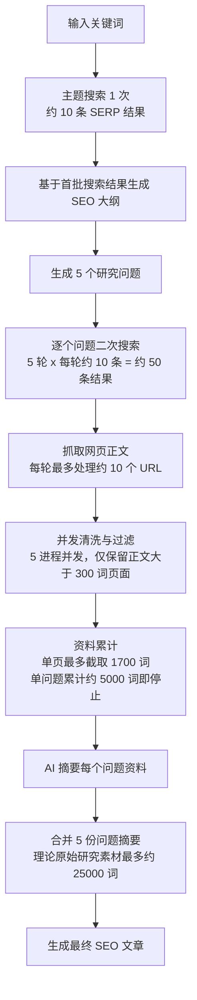
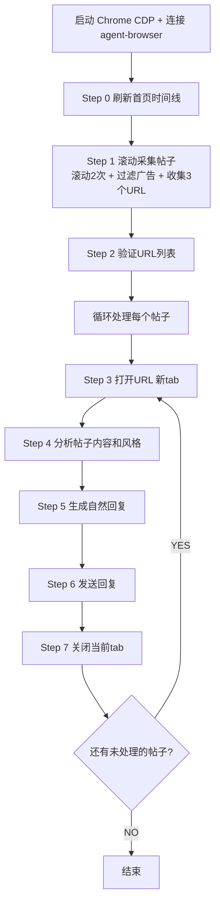

## 一、先说结论：Claude Code 已经超出了“写代码”的范围

很多人第一次听到 Claude Code，会以为它只是一个更强的 code assistant，或者只是一个在终端里帮你写代码、改代码的工具。但如果真的用起来，你会发现它早就超出了“code”本身的边界。

它更接近一个**完备的本地智能体（local agent）**。  
这里最关键的一点在于：**code 不再是目的，而是手段；code 变成了一种元能力。**

过去我们和 AI 的关系，大多停留在聊天窗口里：问一个问题，得到一段回答。但 Claude Code 的真正价值，是让 AI 从聊天窗口里“走出来”，进入真实的工作环境，开始直接参与并推动工作本身。也就是说，AI 不再只是提供建议，而是可以逐步接管中间过程，实际行动起来。

所以我现在理解 Claude Code，不是“一个写代码的工具”，而是一个让 AI 真正进入业务、接管流程、开始执行工作的入口。

---

## 二、为什么是 Claude Code

我之所以反复强调 Claude Code，不是因为它“新”，而是因为在当前阶段，它几乎是我看到的最成熟、最稳定、最能真正落地的 agent 方案之一。

### 1. 模型能力足够强

从模型能力来看，它背后对应的是目前非常强的一档模型能力。这件事很重要，因为 agent 的上限，本质上仍然受模型理解力、规划力、工具调用能力和长链路稳定性的限制。

### 2. agent 客户端做得足够成熟

很多人低估了“客户端”这件事。真正把 agent 用起来，不只是模型强就够了，还需要一个足够好的交互和编排层。Claude Code 在这方面的优势很明显：它不仅能理解任务，还能把任务拆开、串起来、执行下去。

### 3. 它几乎是当前“稳定使用 agent”的唯一解之一

现在市面上不是没有类似方案，但真正能做到**稳定、连续、可复用地跑工作流**的，其实很少。大多数替代品要么停留在 demo 阶段，要么在复杂任务里很快失稳。而 Claude Code 至少已经让我感受到，它不是概念验证，而是能上手干活的东西。

### 4. 市场反馈高度一致

无论是硅谷技术圈，还是简中推特上的早期使用者，对它的评价都非常一致：真正用明白之后，会明显感觉工作方式发生了变化。

### 5. 门槛高，反而意味着先手优势

Claude Code 的确有安装门槛、网络门槛、账号门槛、使用门槛。  
但这些门槛并不意味着它不能用，恰恰相反——**这些门槛基本都有标准答案。**

也正因为门槛高，才会形成隔绝效应。大部分人还没真正进场，少数先用起来的人，就能先获得效率红利和认知红利。

所以我的判断是：现在也许已经不算“特别早”，但在中文环境、尤其是在国内使用环境下，**只要你比别人先一步真正把它用起来，你就已经有先手优势了。**

---

## 三、如何安装与入门

关于安装和入门，其实我已经在课程里系统讲过，相关内容包括：

- 新手如何安装 Claude Code
    
- 在国内环境下如何获取访问权限
    
- 如何从 0 开始学会使用 Claude Code
    
- 以及更深度的垂直课程，比如 **Claude Code + SEO 提效课程**，目前也在策划中，预计会拆成 5 节左右
    

所以安装本身不是今天的重点。  
重点不是“怎么装上”，而是：**装上之后，你会不会真的拿它去接管工作。**

换句话说，安装只是入口，真正的核心是后面的工作流设计、任务拆解和业务落地。

---

## 四、Claude Code 到底能做什么

如果用一句最直接的话来概括：**basically everything。**

当然，这句话不是说它什么都能完美做到，而是说：在大多数数字化工作中，它都能不同程度介入，并且很多场景下已经可以真正产生产出。

我会把它能做的事情分成三个层次来看：

### 1. 自然语言交互层

这是大家最熟悉的一层。你通过自然语言描述需求，AI 理解你的意图、帮你规划、帮你生成内容、给你建议。

### 2. 代码层

中间真正关键的是这一层。以前很多事情理论上“可以自动化”，但卡在了代码实现门槛上：你知道可以做，但你自己不会写，或者懒得写，或者写出来维护成本太高。

Claude Code 最妙的一点，就是它开始**接管这层代码实现**。  
它可以把“我要实现一个工作流”翻译成具体的脚本、调用、串联、执行逻辑，而你不需要自己成为程序员。

### 3. 实际工作环境执行层

再往上一层，就是最有价值的一层：它开始进入真实工作环境去执行任务。比如：

- 回邮件
    
- 分析热点
    
- 发帖
    
- 抓取内容
    
- 整理数据
    
- 跑社媒运营流程
    
- 辅助内容生产和投放
    

这一层意味着什么？意味着 AI 不再只是“告诉你怎么做”，而是开始**替你把中间流程跑掉**。

而这正是我觉得最重要的地方：  
**Claude Code 接管了中间的代码层，于是整个工作流终于被真正打通了。**

以前大家说 AGI 还没来，是因为 AI 只能回答问题，不能真正进入生产流程。  
但当它开始接管流程、串联工具、输出结果、形成闭环时，我的感受就是：**AGI 其实已经非常温柔地到来了。**

---

## 五、几个实际案例

下面我不讲抽象概念，直接讲几个已经落地的案例。

---

## Case 1：SEO 文章工作流

很多人以为 SEO 写作就是“输入一个关键词，AI 自动生成一篇文章”。  
但真正做过 SEO 的人都知道，事情根本没有这么简单。

在我当前项目的实现里，SEO 写作不是一步到位，而是一个多阶段研究和写作流程。它更像是在模拟一个真正有研究能力的内容团队，而不是一个简单的文本生成器。

### 这个流程是怎么跑的

第一步，不是直接写，而是先做一轮**主题搜索**，拿到竞品信息和搜索意图。  
这一轮的作用，是帮助系统理解：这个关键词所在的内容生态是什么，用户真正关心的是什么，市场上已有内容是怎么组织的。

第二步，基于首轮搜索结果，生成一个**SEO 大纲**。  
这个大纲不是拍脑袋写的，而是建立在 SERP 和竞品内容之上的。

第三步，在大纲基础上继续拆解，生成 **5 个研究问题**。  
这一步非常关键，因为它把一个大主题拆成了多个可研究、可验证、可分别追踪的信息子问题。

第四步，围绕这 5 个研究问题，继续做第二轮搜索。  
也就是说，系统不是只搜一次，而是会围绕每个问题分别去查资料、抓网页、做清洗和摘要。

### 从数据量上怎么理解这个流程

整个流程一共会跑 **6 轮搜索**：

- 1 次主题搜索
    
- 5 次问题搜索
    

代码里没有显式设置每次搜索的返回条数，所以通常可以按 Google Custom Search 的默认值理解：**每次大约返回 10 条结果。**

因此理论上，整个流程会汇总 **约 60 条搜索结果**：

- 前 10 条用于生成大纲
    
- 后 50 条用于深度研究
    

### 研究阶段的处理逻辑

在研究阶段，每个问题最多处理大约 **10 个 URL**。  
系统会用 **5 个并发进程**抓取网页内容，并进行清洗和过滤。

过滤规则包括：

- 只保留正文超过 **300 词**的页面
    
- 单个页面清洗后最多截取 **1700 词**
    
- 单个研究问题累计到 **约 5000 词**时停止继续收集
    

这样算下来，5 个问题理论上最多可以汇总出 **约 25000 词**的研究素材。  
之后，再把这些素材交给写作模型，生成最终的 SEO 文章。

### 这件事真正说明了什么

重点不是“AI 帮我写了一篇文章”，而是：  
**AI 帮我把“研究—整理—写作”这一整套 SEO 内容生产流程跑通了。**

它不是一个 prompt，而是一个工作流。

---

### SEO 工作流示意



---

## Case 2：LinkedIn Post 生成

LinkedIn 和其他社媒平台最大的不同在于，它是一个非常典型的 **2B 平台**。  
这意味着用户对内容语气、表达方式、篇幅控制、结构组织、CTA 和 hashtag 的接受度，都和其他平台不一样。

所以，LinkedIn post 的问题，本质上不是“写一条帖子”这么简单，而是一个**风格迁移**的问题。

### 当前项目里的生成逻辑

根据项目中的技能说明 `.claude/skills/gen-linkedin-post/SKILL.md`，这个流程不是凭空写文案，而是分几步走。

第一步，是到 **tool page** 里查找对应主题的产品文档。  
这里提取的内容必须是**可验证的事实信息**，比如：

- 功能
    
- 能力
    
- 平台支持
    
- 指标
    
- 定价
    

第二步，是去 **reference** 中分析竞品的 LinkedIn 文案。  
但这里不是为了抄内容，而是为了提取它们的“写法”，比如：

- 语气
    
- 结构
    
- 开头的 hook
    
- CTA 写法
    
- hashtag 使用方式
    

需要特别强调的是：  
这里只借鉴表达方式，不复用对方的数据、产品能力或事实描述。

第三步，围绕不同的传播角度，生成多条风格和长度不同的 LinkedIn posts。  
也就是说，它不是只生成一条，而是会做差异化输出。

第四步，补齐 CTA 和 hashtag，并且以**我的品牌词**作为首个 hashtag。  
在你这个流程里，`#wayinvideo` 必须放在第一位。

第五步，做一轮事实检查和重复表达检查，最后输出成 markdown 文件，保存到：

`output/linkedin-post-{topic}-{timestamp}.md`

### 这个流程解决的是什么问题

它解决的不是“AI 会不会写文案”，而是：  
**AI 能不能在不同平台里，学会不同平台的表达规则，并在事实边界内做风格迁移。**

这才是社媒自动化真正有价值的地方。

---

### LinkedIn Post 工作流示意

```mermaid
flowchart TD
    A[输入 topic / count / angles] --> B[在 tool page/ 查找相关产品文档]
    B --> C[提取事实信息: 功能 能力 平台 指标 定价]
    C --> D[在 reference/ 读取竞品 LinkedIn 文案]
    D --> E[分析风格: 语气 结构 Hook CTA Hashtags]
    E --> F[定义不同内容角度]
    F --> G[生成多条 LinkedIn Posts]
    G --> H[控制差异化: 不同风格 不同长度 不同切入点]
    H --> I[补充 CTA 与 hashtags<br/>#wayinvideo 必须放第一]
    I --> J[做事实校验与 plagiarism check]
    J --> K[保存到 output/linkedin-post-{topic}-{timestamp}.md]
```

---

## Case 3：Twitter 自动运营

再看一个更偏执行层的案例：Twitter 自动运营。

这个案例的意义在于，它已经不只是“内容生成”了，而是进入了真实的平台交互和动作执行。

### 这个流程怎么跑

首先，启动 Chrome CDP 9222，并连接 `agent-browser`。  
接着，**强制刷新首页时间线**。这一步是必须的，因为如果首页时间线不刷新，抓到的帖子可能是旧内容，后面的互动质量就会下降。

然后系统开始滚动采集帖子，至少滚动两次。  
在滚动过程中，一边采集，一边过滤广告，最后收集出 **3 个有效 URL**。

接下来，会对 URL 列表做一次确认。  
确认之后，逐条处理：

1. 打开 URL，并自动创建新 Tab
    
2. 对帖子内容、表达风格和现有回复进行 snapshot 分析
    
3. 组织一条自然风格的回复
    
4. 回复要求尽量简洁，通常控制在 **1–2 句**，并尽可能匹配原帖语气
    
5. 点击回复输入框，输入内容并发送
    
6. 关闭当前 Tab，只保留 Tab 0
    
7. 如果还有未处理的帖子，则继续循环
    

### 这说明了什么

这说明 agent 已经不仅仅停留在“生成一句评论”这个层面，而是开始具备了：

- 观察上下文
    
- 分析平台语境
    
- 执行动作
    
- 循环处理任务
    

也就是说，它已经非常接近一个**可操作的社媒执行代理**了。

---

### Twitter 自动运营流程图



---

## 六、我还实现过什么

除了上面几个比较典型、比较完整的案例，我其实还做了很多其他工作流，包括但不限于：

- Medium 自动养号
- YouTube VOC 分析
- YouTube KOL 视频数据批量抓取
- Landing page 文案自动化优化
- 文章配图自动化
- 以及其他大量琐碎但重复性的工作
- 生成演讲ppt
    

这些零散案例背后，其实都在说明同一个判断：

> **只要一项工作你重复做过 3 次以上，它基本就值得被拆解成工作流。**

这个标准非常朴素，但很有用。  
因为很多人总觉得“这个事情还没复杂到值得自动化”，结果就是永远停留在手工做事。  
但只要你重复做过三次，你其实就已经拥有了把它抽象成 SOP 的基础。

---

## 七、真正的核心：从代码，走到业务逻辑

如果让我总结这件事最本质的变化，我会说：

**我们终于从“代码能力”走到了“业务逻辑能力”。**

过去做自动化，重点是会不会写代码。  
现在做自动化，重点开始变成：**你能不能把业务逻辑拆清楚。**

也就是说，真正的护城河不再只是程序员能力，而是你对自己工作流的理解深度。

### 最值得思考的问题有两个

#### 1. 你能不能拆解业务逻辑

一个人如果对自己的工作没有结构化理解，就很难把工作交给 agent。  
因为 agent 不怕复杂，它怕的是模糊。

#### 2. 你的 SOP 到底能拆到什么程度

很多原本被认为“只能人工完成”的工作，拆细之后会发现，里面其实有大量稳定、重复、可判断、可串联的步骤。  
而这些步骤，就是最适合交给 agent 接管的部分。

所以未来真正的竞争力，不只是“谁会用 AI”，而是谁更擅长把自己的工作拆成可执行的业务单元。

---

## 八、几个很重要的注意点

### 1. 可迁移性非常强

一个工作流一旦成立，通常并不只适用于一个平台。

比如 Twitter 可以做养号，那么：

- Pinterest 也可以
    
- Reddit 也可以
    
- Quora 同理也可以
    

本质上，这些平台之间的差异只是表层规则不同，但底层逻辑往往相通：  
发现内容、理解语境、产出互动、维持账号活跃、逐渐建立分发和信号。

同样，文章工作流可以成立，那么视频脚本工作流也一样可以成立。  
因为它们的底层都包含：选题、研究、结构、表达、风格适配、输出。

### 2. 可调性非常高

工作流不是一旦写完就固定不变，它是可以持续调的。

你可以调：

- 自己需要的语气
    
- 自己所在的行业
    
- 某个具体环节的执行方式
    
- 某个平台的格式要求
    
- 某个受众偏好的表达风格
    

所以工作流不是死板的自动化脚本，而更像是一套可调参数的业务系统。

---

## 九、关于 Skill：经验如何沉淀为能力

我现在越来越强烈地觉得，Skill 是未来非常重要的一层。

### 1. 几乎所有事情都可以从“先搜有没有现成 skill”开始

很多需求并不需要从零开发。  
比如：

- 下载视频
    
- 视频转文字
    
- 文字转视频
    
- 图片批量压缩
    
- 各种格式转换
    
- 数据清洗
    
- 内容批处理
    

这些你能想到的事情，往往已经有人做过 skill 了。  
所以最聪明的做法，不是每次都重造轮子，而是先站在巨人的肩膀上。

### 2. Skill 可以组合、可以编排

真正厉害的地方不是单个 skill，而是 skill 和 skill 之间的组合。  
当 skill 可以被调用、被复用、被串联，工作流就会越来越像一个模块化系统。

### 3. 所有经验都可以沉淀成 skill

这一点特别重要：  
你做过的事情，不应该只停留在“我会做”，而应该沉淀成“以后可以直接调用”。

也就是说：

- 经验不再只是经验
    
- 经验可以变成结构
    
- 结构可以变成 skill
    
- skill 可以被反复调用
    

### 4. 一个简单判断标准

> **所有做过 3 次以上的动作，都值得考虑 skill 化。**

这是我现在非常相信的一个原则。  
因为重复，本身就意味着有模式；  
而一旦有模式，就值得被抽象。

---

## 十、我的原则：不妥协

这部分我会讲得非常直接。

### 1. 不使用 Claude Code 平替

如果目标是真正建立稳定 agent 工作流，那我不愿意在关键工具上妥协。  
“能不能找个差不多的替代品”这个思路，很多时候看似省钱，实际上是在浪费时间。

### 2. 不使用国产模型替代

这里不是做情绪判断，而是做效率判断。  
如果一个工具在核心能力、稳定性、长链路执行上明显不够，那么继续围绕它做实验，本质上就是在消耗生命时间。

### 3. 任何一点犹豫，都是对时间的浪费

我的态度很简单：  
**在真正重要、真正能改变工作方式的工具上，不要反复犹豫。**

因为你犹豫的不是工具本身，而是在犹豫要不要更早进入下一代工作方式。

---

## 十一、最后讲一个非常关键的概念：Token Maxing

讲到这里，必须补一个现实问题：  
**目前最大的限制之一，其实是 token 成本。**

比如 Claude Max：

- 渠道价大约 90 美金
    
- 正价大约 200 美金
    
- 换算下来大概是 800 到 1500 元人民币区间
    

这不是一个很低的成本。  
但我想说的是，真正该思考的问题，不只是“贵不贵”，而是：**你怎么看 token 这件事。**

### Token Maxing 是什么

Token maxing 是一个来自硅谷的概念。  
它背后的心态其实很有意思：既然额度已经买了，那就应该在额度范围内把 token 用尽，不然反而会有一种没把价值吃满的负罪感。

这听起来像玩笑，但其实很真实。  
因为一旦你开始把 token 当成“生产资料”而不是“聊天消耗品”，你的使用方式就会彻底变化。

### 更进一步的想象

我甚至认为，未来一个人入职公司时，除了薪资 package 之外，还应该包含公司给予的可调用 token 配额。

比如每年给你 **25 万美金的 token 额度**。  
这不是夸张设想，而是一个非常值得认真思考的未来组织配置方式。

因为如果 token 真正进入生产系统，那它就会像服务器预算、广告预算、软件预算一样，成为企业的基础资源。

### 一个值得所有人思考的问题

如果 token 不再是限制条件，  
那么：

- 你的哪些工作会被直接替代？
    
- 你最先想交给 agent 的任务是什么？
    
- 如果内容问题被彻底解决，我们下一步该做什么？
    

这几个问题，比“AI 会不会替代我”更重要。  
因为真正的问题不是替代，而是：**当生成与执行能力被释放之后，你会把注意力放到哪里。**

### 我自己的感受

我越来越觉得，我们其实已经温柔地跨过了某种奇点。  
至少在内容生产这个维度上，很多过去需要大量人工时间去填补的环节，正在迅速被改写。

所以真正重要的，已经不是“接受不接受 AI”，而是：  
**在内容问题逐渐被解决之后，我们接下来要建设什么、放大什么、重新定义什么。**

---

## 十二、结尾

最后，欢迎大家关注我的公众号。  
那里会更新我最近每天的一些思考，包括：

- Claude Code
    
- agent 工作流
    
- SEO 与社媒自动化
    
- 以及我对内容、效率和下一代工作方式的一些判断
    
